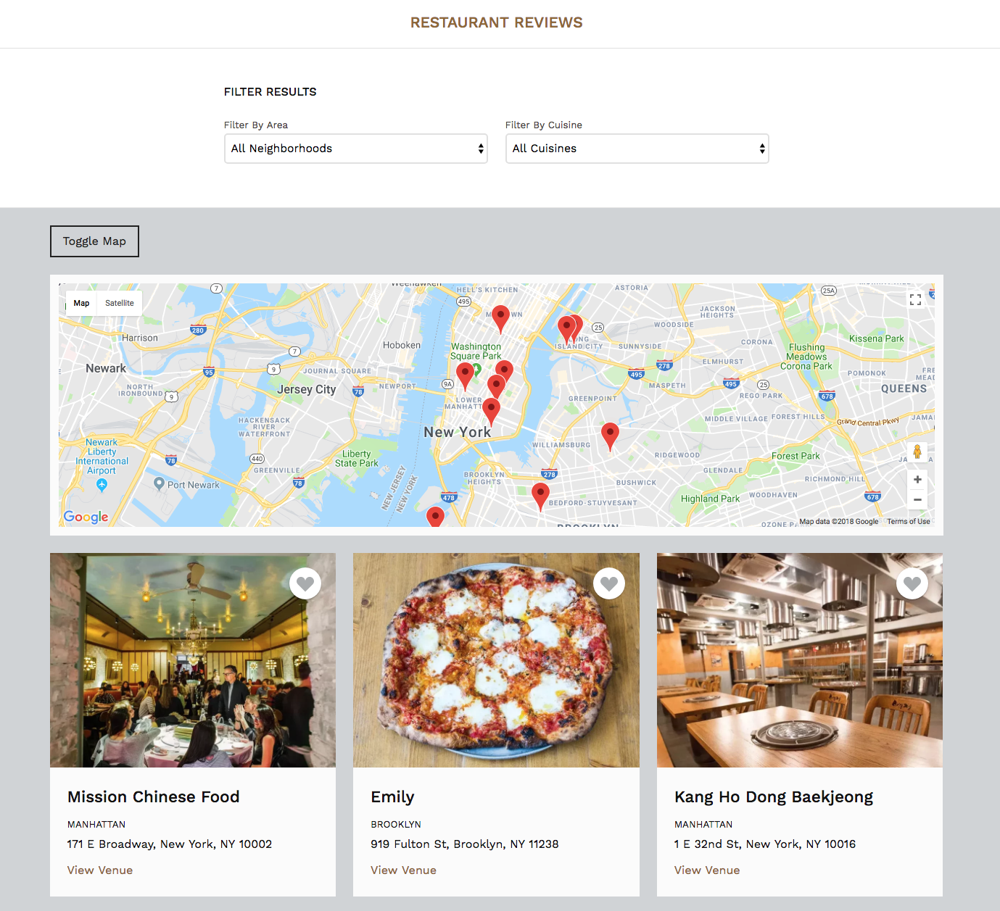

# Mobile Web Specialist Certification Course - Project 3
---


### Project Tasks
------
For the **Restaurant Reviews** projects, you will incrementally convert a static webpage to a mobile-ready web application. In **Stage One**, you will take a static design that lacks accessibility and convert the design to be responsive on different sized displays and accessible for screen reader use. You will also add a service worker to begin the process of creating a seamless offline experience for your users.

In **Stage Two**, you will take the responsive, accessible design you built in Stage One and connect it to an external server. You’ll begin by using asynchronous JavaScript to request JSON data from the server. You’ll store data received from the server in an offline database using IndexedDB, which will create an app shell architecture. Finally, you’ll work to optimize your site to meet performance benchmarks, which you’ll test using Lighthouse.

In **Stage Three**, you will take the connected application you built in Stage One and Stage Two and add additional functionality. You will add a form to allow users to create their own reviews. If the app is offline, your form will defer updating to the remote database until a connection is established. Finally, you’ll work to optimize your site to meet even stricter performance benchmarks than the previous project, and test again using Lighthouse.

### Project Features
------
* Responsive Design built using CSS Flexbox.
* The ability to filter restaurants by neighborhood and cuisine type.
* A Google Map with animated Google Map Markers retrieved asynchronously from the **Google Maps API**.
* Accessibility features.
* A simple offline-first caching strategy using a service worker.
* Uses IndexedDB to cache JSON responses from a Node.js server.
* Allows users to submit a restaurant review online and offline.
* Allows users to mark a restaurant as a favourite.

### Getting started
------

First go to the master branch of the project and get a copy of the repository by either downloading the zipped project files to your computer or via the command line.

```sh
https://github.com/LeaSak/MWS-Restaurant-Review-App/
```

To view the app, navigate to the project, go to the project's **dist** directory. In this folder, start up a simple HTTP server to serve up the site files on your local computer. For example, with Python: `python -m SimpleHTTPServer 8000`

Also, clone the server repository from [here](https://github.com/udacity/mws-restaurant-stage-3). Follow the instructions to get the local development API server up and running.

So far it's only been tested in Google Chrome.

All development files are located in the **src** directory. This project was built using Gulp and Sass. For more information, please inspect **gulpfile.js**

### Feedback
------
Feedback is very welcome, leaann.sakmann@gmail.com


